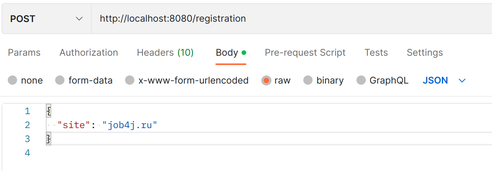
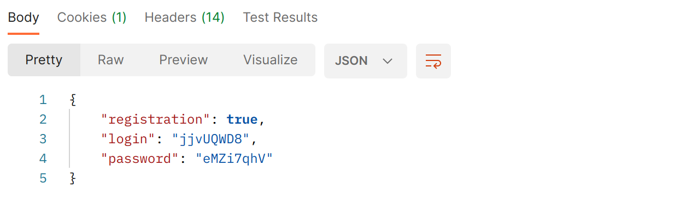
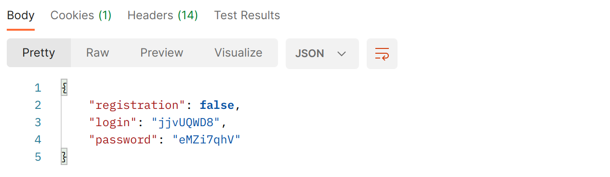
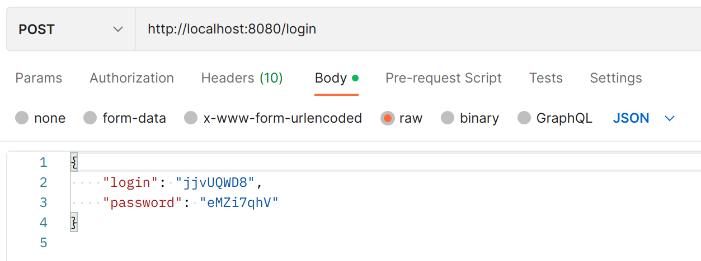
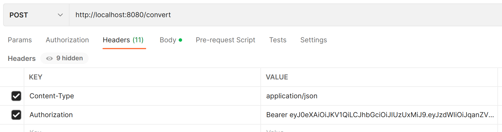
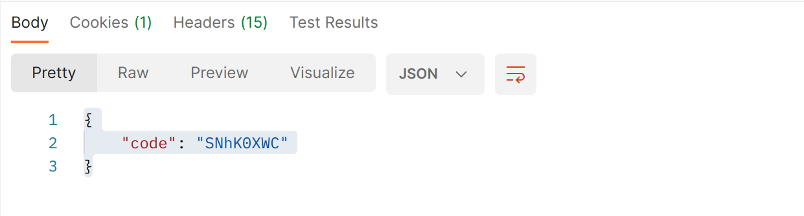
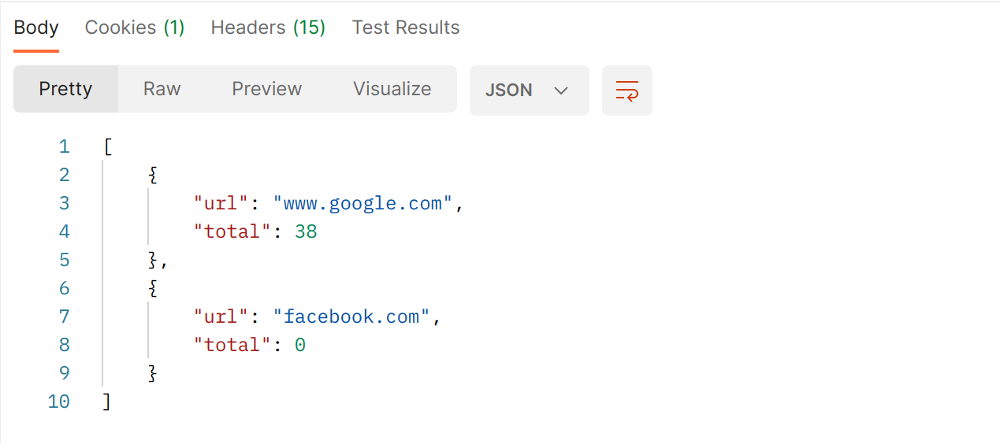

## Сервис UrlShortCut
***
Данный сервис выполняет преобразование ссылок в укороченный вид. Для создания коротких ссылок требуется
регистрация. Для перехода по коротким ссылкам регистрация не требуется.

> **Используемыe технологии**: _Java 17, Spring boot 2, Spring Data JPA, Spring Security, Postgres 14, Lombok, Liquibase_

***
**Требуемые элементы:**
* PostgreSql 14
* JDK 17
* Maven 3.x
* Созданная база данных
***
**Запуск проекта**

Используя командную строку:

* создать базу данных с именем ***url_shortcut***
* поменять login/password в файле src/main/resources/application.properties и src/main/resources/liquibase.properties
* выполнить в консоле команду `mvn install`
* выполнить в консоле команду java -jar `target/url_shortcut-0.0.1-SNAPSHOT.jar`

Используя Docker:
* создать необходимые docker образы `docker-compose build`
* запустить проект `docker-compose up -d`

Использую Kubernetes:
* в дериктории с проектом запустить терминал
* в терминале выполнить команду `bash k8s/commands.sh`

**Работа с приложением**

Для преобразования ссылок требуется регистрация. Для это необходимо выполнить запрос:

`POST /registration`

со следующим телом:
`{
"site": "job4j.ru"
}`
где ключу *site* соотвтествует имя регистрируемого сайта

В ответ придет json со сформированным логином и паролем, а так же флагом, что данный пользователь 
еще не был зарегестрирован:

При повторном отправлении запроса с тем же ключем будут высланы ранее
сформированные *login/password*:

На следующем этапе требуется выполнить аутентификацию с помощью запроса:

`POST /login`

содержащем  JSON с ранее полученными логин/паролем:

В ответе под ключем *Authorization* будет распологаться [JWT](https://ru.wikipedia.org/wiki/JSON_Web_Token) токен следующего вида:

`Bearer xxx.yyy.zzz `

Для получения короткой ссылки нужно направить запрос:

`POST /convert`

с телом следущего вида:

`{
"url": "google.com"
}`

где под ключем _url_ указывается укорачиваемая ссылка. Так же в заголовках запроса
должен присутствовать заголовок _Authorization_ со значением, полученным на этапе
аутентификации:

В ответе будет JSON содержащий укороченную ссылку:

Для получения полной версси сылки достаточно послать запрос (без аторизации):

`GET /redirect/CODE`

где _CODE_ это короткая ссылка, полученная ранее. В ответе в заголовке
по ключу _Location_ будет лежать полный вариант ссылки.

Сервис предоставляет статистику по следующему запросу:

`GET /statistic`

Для получения статистики требуется наличие авторизационного токена 
в заголовках запроса. Ответ представляет собой массив JSON:

***
**Контакты**

email : geraldik1986@gmail.com